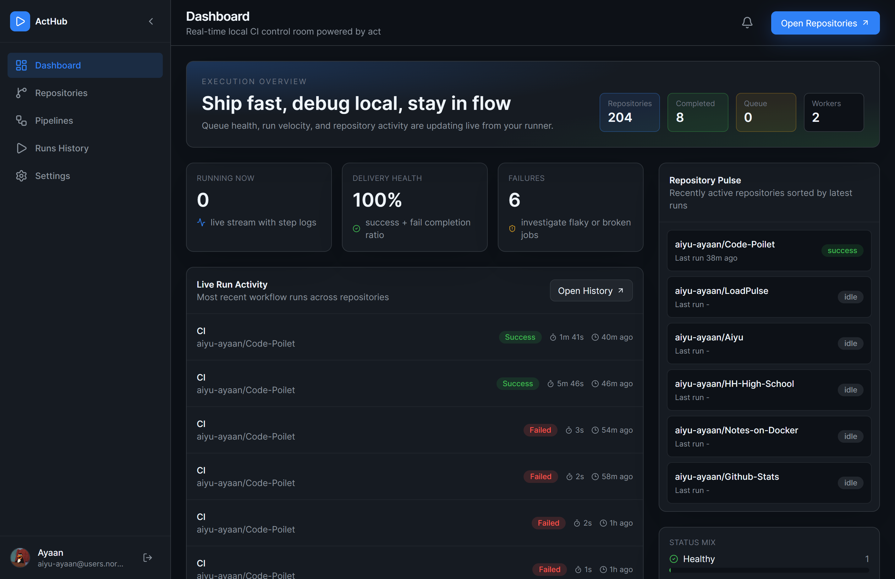
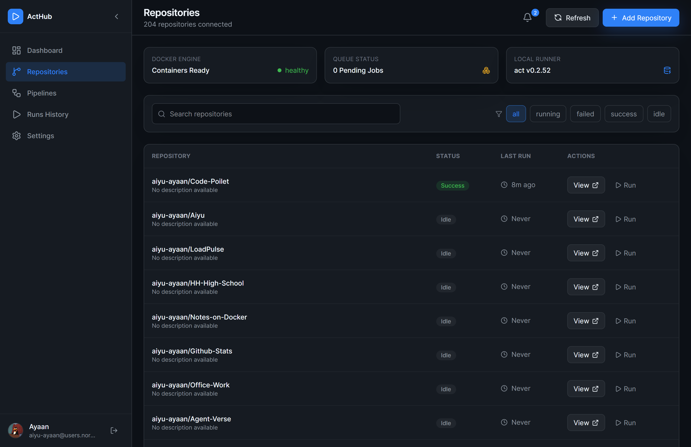

# CodePilot

CodePilot is a local-first CI/CD dashboard inspired by GitHub Actions and powered by `nektos/act`.

> Status: `In Development`
>  
> The product is actively evolving. Expect fast iteration, UI improvements, and backend feature updates.

## What It Does

- GitHub OAuth login with repo-layer permissions
- Sync and manage repositories from your GitHub account
- Discover workflow files from `.github/workflows/*.yml`
- Trigger local pipeline runs via `act`
- Live queue + run updates through WebSockets
- Stream run logs in near real time
- Save encrypted workflow environment profiles in MongoDB
- Optional Redis cache with memory fallback

## Tech Stack

- Frontend: React + Vite + TypeScript (`src/`)
- Backend: Express + TypeScript (`backend/src/`)
- Database: MongoDB
- Cache: Redis (optional)
- Runner: `nektos/act` (binary or Docker Compose mode)
- Live transport: WebSocket (`/live`)

## Screenshots





## Prerequisites

- Node.js 20+
- npm 10+
- Git
- Docker Desktop (recommended for `act` runner mode)
- MongoDB instance (local or hosted)
- Redis (optional)

## 1) Clone + Install

```bash
git clone https://github.com/aiyu-ayaan/Code-Poilet
cd code-pilot
npm install
```

## 2) Configure Environment

Copy `.env.example` to `.env` and set values:

```env
NODE_ENV=development
PORT=8090
APP_ORIGIN=http://localhost:5173
VITE_API_PROXY_TARGET=http://localhost:8090

MONGODB_URI=mongodb://localhost:27017/acthub
REDIS_URL=redis://localhost:6379

JWT_SECRET=replace-with-a-very-long-random-string-min-32-chars
ENV_ENCRYPTION_KEY=replace-with-another-long-random-string-min-32-chars

GITHUB_CLIENT_ID=your-github-oauth-client-id
GITHUB_CLIENT_SECRET=your-github-oauth-client-secret
GITHUB_CALLBACK_URL=http://localhost:8090/api/auth/github/callback

REPOS_ROOT=./runtime/repos
ACT_RUNNER_MODE=compose
ACT_BINARY=act
ACT_DOCKER_BINARY=docker
ACT_DOCKER_HOST=native
ACT_COMPOSE_FILE=docker-compose.local.yml
ACT_COMPOSE_SERVICE=act-runner
ACT_CONTAINER_REPOS_ROOT=/workspace/runtime/repos
ACT_REUSE_CONTAINERS=true
ACT_OFFLINE_MODE=true

MAX_CONCURRENT_RUNS=2
WORKER_POLL_INTERVAL_MS=2500
SESSION_TTL_HOURS=24
```

## 3) Create GitHub OAuth App

In GitHub Developer Settings:

1. Set `Homepage URL` to `http://localhost:5173`
2. Set `Authorization callback URL` to `http://localhost:8090/api/auth/github/callback`
3. Copy client ID and client secret into `.env`

## 4) Start Services (Development)

Run the Dockerized `act` runner:

```bash
docker compose -f docker-compose.local.yml up -d --build act-runner
```

Start backend:

```bash
npm run dev:backend
```

Start frontend:

```bash
npm run dev
```

Open app:

- `http://localhost:5173`

## Windows + WSL Note

If Docker is only available inside WSL, set:

```env
ACT_DOCKER_HOST=wsl
```

Otherwise keep:

```env
ACT_DOCKER_HOST=native
```

## Full Deployment via Docker Compose

`docker-compose.yml` includes app services with MongoDB for a full stack deployment:

```bash
docker compose up --build -d
```

## Scripts

- `npm run dev` - frontend (Vite)
- `npm run dev:backend` - backend in watch mode
- `npm run dev:full` - frontend + backend together
- `npm run build` - frontend production build
- `npm run build:backend` - backend TypeScript build
- `npm run start:backend` - run built backend
- `npm run lint` - lint codebase

## Core API Routes

- `GET /api/auth/github/start`
- `GET /api/auth/github/callback`
- `GET /api/auth/me`
- `POST /api/auth/logout`
- `POST /api/repos/sync`
- `GET /api/repos`
- `GET /api/repos/:owner/:name/workflows`
- `GET /api/repos/:owner/:name/workflows/:file/content`
- `GET /api/repos/:owner/:name/env-profile`
- `POST /api/repos/:owner/:name/env-profile`
- `POST /api/runs/trigger/:owner/:name`
- `GET /api/runs/history`
- `GET /api/runs/:runId`
- `GET /api/runs/status/queue`

## Reliability Features

- Background queue worker with concurrency control
- Run dedupe (same repo + workflow + branch)
- Repo permission check before run trigger
- WebSocket-based live updates for queue + runs
- Encrypted env profile storage per workflow
- Redis caching with in-memory fallback

## License

No license file is currently defined.
